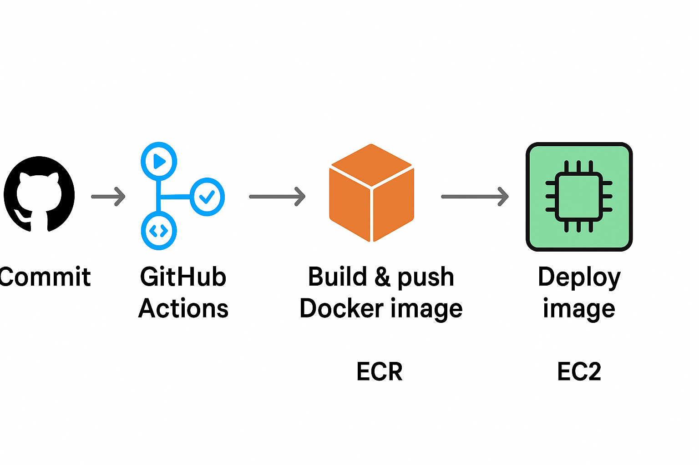

# Alcatraz - Web Ping App

The project contains Python code (Flask web app), Terraform resources, Dockerfile, Github Actions Pipeline
and Python script. 

## Overview 
1. Flask web app which responds with {"hostname": "node", "message: "pong"}
2. Two EC2 instances in eu-central-1 with SG and IAM role attached (IAM role is need for Github actions pipeline)
3. Application Load Balancer distributes traffic across EC2 instances with health check target '/api/ping'
4. ECR stores the Docker image
5. SSH key is need for 
6. Github Action Pipeline builds and pushes Docker image to ECR and deploys containers to EC2 via SSH. The pipeline 
will be triggered when changes are detected in 'web-app/app.py' and pushed to main branch. 

### Prerequisites
- Generated SSH key
- Github repository secrets: AWS_ACCESS_KEY_ID, AWS_SECRET_ACCESS_KEY, ECR_REPOSITORY, EC2_HOST_1, EC2_HOST_2,
EC2_SSH_KEY

### Flow 

